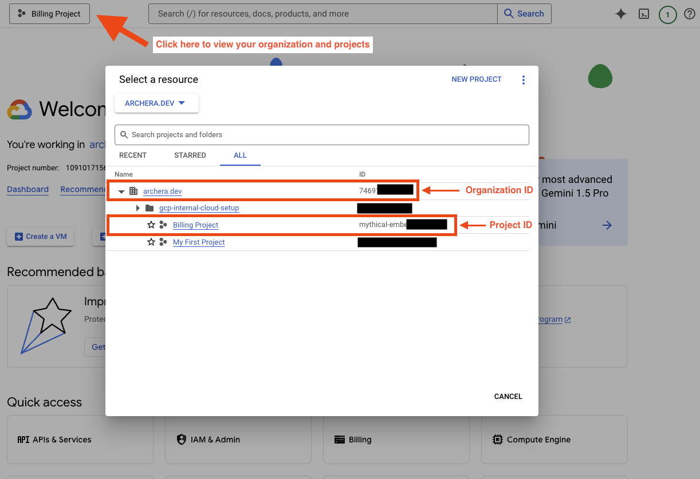
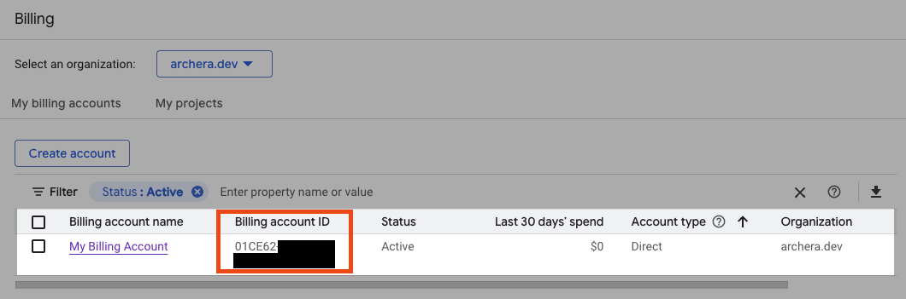
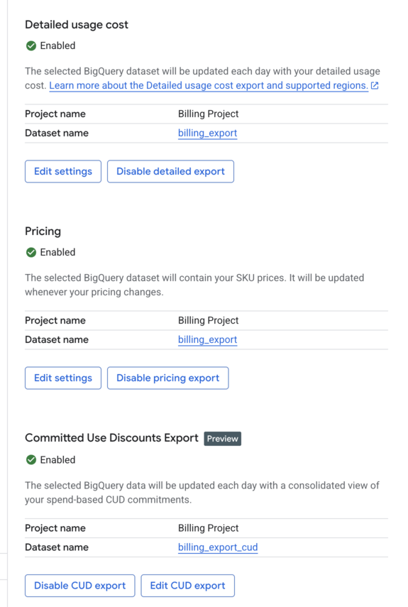
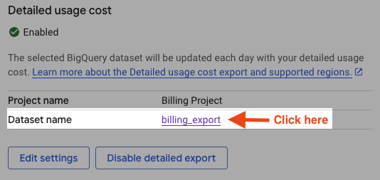
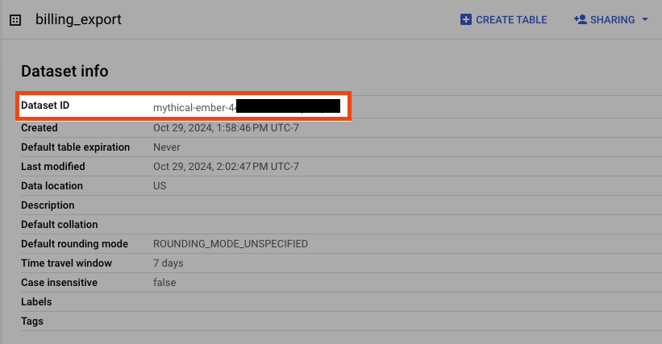
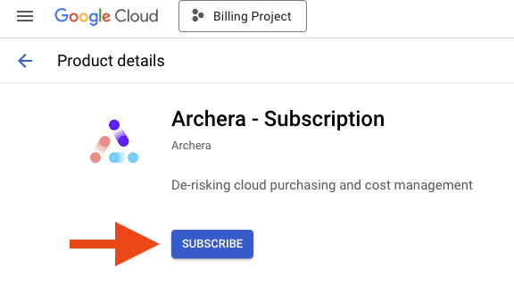
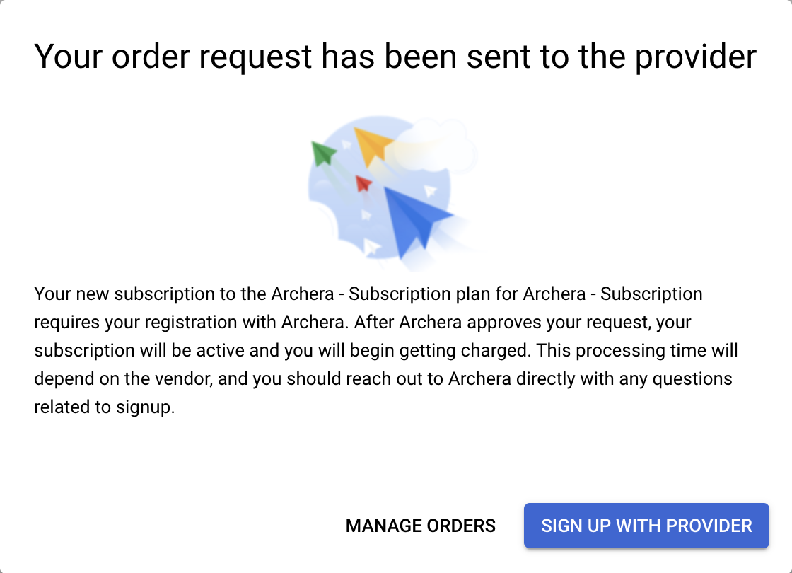
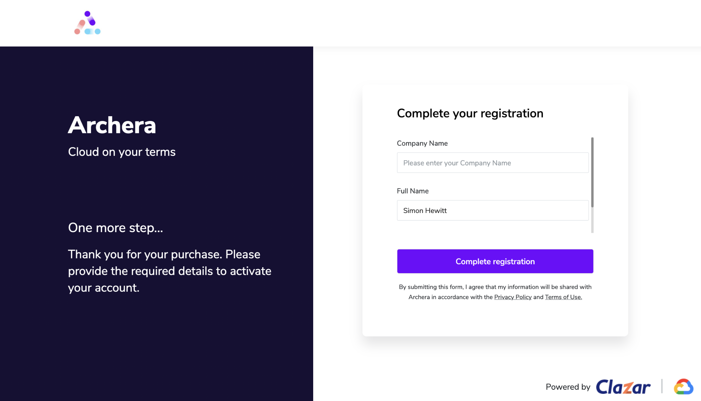

# Archera GCP Onboarding

An interactive script that automates Archera's GCP integration setup via Infrastructure Manager.
Replaces most of the manual steps from Archera's deployment guide with a single command.

Archera only supports **one integration per billing account**. If you have multiple billing
accounts, you'll need to run this once per account. For many billing accounts, contact Archera
for assistance.

## Prerequisites

- [Google Cloud SDK](https://cloud.google.com/sdk/docs/install) (`gcloud` and `bq` CLIs)
- Authenticated as **Organization Owner** on the target GCP org
- An [Archera account](https://app.archera.ai/signup) (create one before starting)

## Quick Start

```bash
git clone https://github.com/jpr5/archera-onboarding.git
cd archera-onboarding
./archera-gcp.sh
```

## What the Script Does

The script walks you through each step interactively, auto-detecting values where possible:

| Step | What | Automated? |
|------|------|------------|
| 1 | Detect/select Organization ID | Yes |
| 2-3 | Detect/select Billing Account | Yes |
| 4 | Select or create a GCP Project (with billing linkage) | Yes |
| 5 | Enable required GCP APIs | Yes |
| 6 | Create BigQuery datasets for billing exports | Yes |
| 7 | Configure billing exports (Detailed, Pricing, CUD) | **Manual** (Console only) |
| 8 | Pre-check org IAM policies for Archera's external SA | Yes |
| 9 | Run Infrastructure Manager deployment | Yes |
| 10-12 | Subscribe in Marketplace, sign up with provider, register | **Manual** |

## Walkthrough

### Steps 1-3: Organization, Billing, and Project

The script auto-detects your GCP organization and billing accounts. If only one of each
exists, it offers it as the default. For multiple billing accounts, you'll see a numbered list
with names and IDs:

```
[INFO]  Multiple billing accounts found:

   1) Production Billing  (01478A-B65ABA-BCFDED)
   2) Dev Billing         (0ABCDE-123456-789DEF)

Enter number or Billing Account ID:
```

For the project, you can:
- **Use the current** `gcloud` project
- **Search** for an existing project by name or ID substring
- **Create a new** project (automatically linked to the selected billing account)

> **Reference:** In the GCP Console, these are found in the organization/project selector
> and the Billing dashboard.
>
> 
> 

### Steps 4-6: APIs and BigQuery Datasets

The script enables all required APIs:

- `bigquery.googleapis.com`
- `bigquerydatatransfer.googleapis.com`
- `billingbudgets.googleapis.com`
- `cloudbilling.googleapis.com`
- `config.googleapis.com` (Infrastructure Manager)
- `iam.googleapis.com`
- `cloudresourcemanager.googleapis.com`
- `storage.googleapis.com`
- `storagetransfer.googleapis.com`
- `cloudcommerceprocurement.googleapis.com`

It then scans existing BigQuery datasets for billing export tables and offers to reuse them
or create new ones. Archera requires:

- **Detailed Usage Cost** export dataset
- **Pricing** export dataset (can be the same as above)
- **CUD (Committed Use Discounts)** export dataset (**must** be separate)

### Step 7: Configure Billing Exports (Manual)

Billing export configuration has no CLI or API support -- it must be done in the GCP Console.
The script prints the exact URL and dataset mappings, then pauses for you to configure them:

```
  1. Go to: https://console.cloud.google.com/billing/<BILLING_ACCOUNT_ID>/export
  2. 'Detailed usage cost' export -> dataset: billing_export in project my-project
  3. 'Pricing' export            -> dataset: billing_export in project my-project
  4. 'Committed Use Discounts'   -> dataset: billing_export_cud in project my-project
```

Enable all three exports pointing at the datasets from the previous step:



To verify the dataset IDs later, click the linked dataset name and check the Details tab:




The full dataset ID includes the project prefix, e.g. `my-project.billing_export`.

### Step 8: IAM Policy Pre-check

Archera's deployment grants IAM bindings to an external service account
(`application@archera.iam.gserviceaccount.com`). If your organization has IAM domain
restriction policies, this will fail.

The script proactively checks two org policy constraints:

- **`iam.managed.allowedPolicyMembers`** -- if set, Archera's SA must be in `allowedMemberSubjects`
- **`iam.allowedPolicyMemberDomains`** -- if set, Archera's customer ID `C02c8qgso` must be in `allowedValues`

If a constraint is active but missing Archera's entry, the script offers to update it or
prints the exact commands for manual remediation.

### Step 9: Infrastructure Manager Deployment

The script runs Archera's Infrastructure Manager deployment inline. You'll need the **GCS URL**
from Archera's onboarding page -- it looks like:

```
gs://archera-production-onboarding/<unique-id>/
```

You can paste either the raw URL or the full `gsutil cat ... | bash` command; the script
extracts what it needs. The deployment:

1. Creates a temporary service account with the required roles (Owner, Role Admin,
   Org Admin, Org Role Admin, Billing Admin)
2. Writes Terraform variables from your collected IDs
3. Runs `gcloud infra-manager deployments apply` with Archera's Terraform configs
4. Cleans up the temporary service account on exit

What Archera's Terraform deploys:
- An organization-level IAM role for the Archera application service account
- A role binding from that role to Archera's service account
- A Cloud Storage bucket for exported billing data
- Storage Transfer Service permissions for Archera to copy billing/pricing/CUD data

> **Note:** The GCS URL is only valid for **7 days** from when Archera generates it. If it
> expires, request a new one from Archera's onboarding page.

> **Debug mode:** If the deployment fails, you can re-run with more detail by setting
> `DEBUG=true` before running the script, or by running Archera's original command:
> `gsutil cat gs://.../<id>/deploy.sh | DEBUG=true bash`

### Steps 10-12: Marketplace and Registration (Manual)

These final steps must be done in the browser:

**Subscribe to Archera** -- Search "Archera" in the GCP Marketplace and subscribe to
"Archera - Subscription". Make sure the correct billing account is selected.



**Sign up with Provider** -- After subscribing, click "Sign up with provider". You'll be
redirected to Clazar (Archera's marketplace transaction partner) to sign in.



**Complete Registration** -- Fill in your company name and details on Archera's registration
page, or log into your existing Archera account.



## Information Collected

At the end of the automated steps, the script prints a summary of all IDs you'll need for
Archera's onboarding form:

| Field | Example |
|-------|---------|
| Organization ID | `302636258399` |
| Project ID | `archera-integration` |
| Billing Account ID | `01478A-B65ABA-BCFDED` |
| Billing Export Project ID | `archera-integration` |
| Billing Export Dataset ID | `archera-integration.billing_export` |
| Pricing Export Dataset ID | `archera-integration.billing_export` |
| CUD Export Dataset ID | `archera-integration.billing_export_cud` |

## Troubleshooting

### IAM policy error during deployment

```
One or more users named in the policy do not belong to a permitted customer
```

This means an org policy is blocking Archera's external service account. The script's
pre-check (Step 8) should have caught this, but if you skipped it:

- For `iam.managed.allowedPolicyMembers`: add
  `serviceAccount:application@archera.iam.gserviceaccount.com` to `allowedMemberSubjects`
- For `iam.allowedPolicyMemberDomains`: add customer ID `C02c8qgso` to `allowedValues`

See [Restricting identities by domain](https://cloud.google.com/resource-manager/docs/organization-policy/restricting-domains)
for details.

### Deployment timeout or transient errors

Re-running the script (or Archera's original deployment command) is safe -- the deployment
is idempotent. The temporary service account is recreated if needed.

### Billing exports not appearing

Billing export data can take **24-48 hours** to start populating in BigQuery after initial
configuration.

## License

MIT
